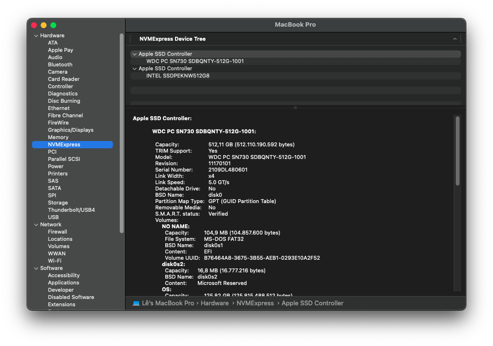
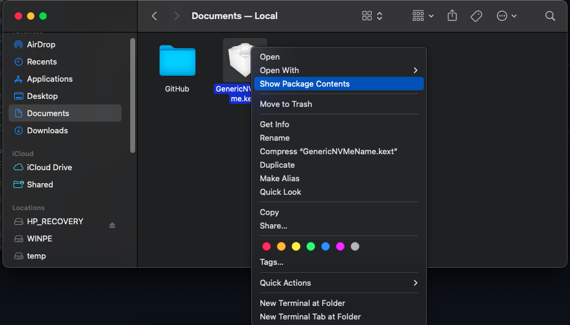
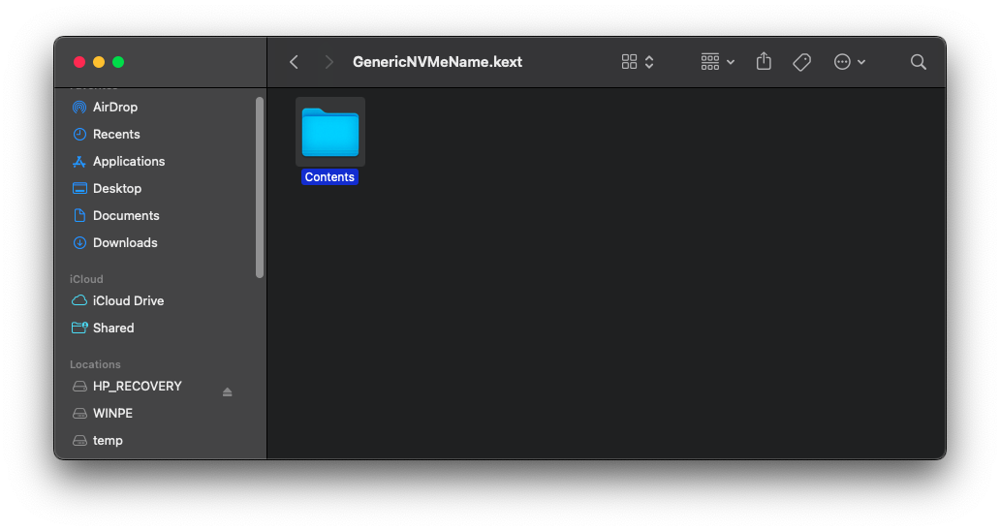
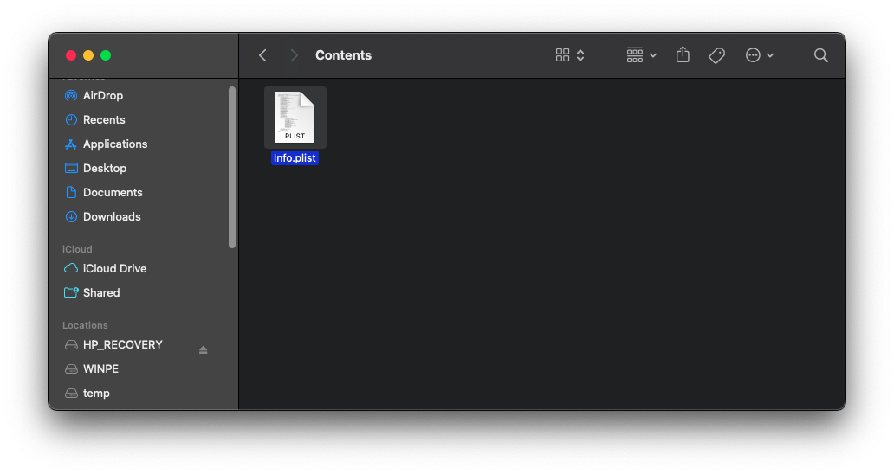
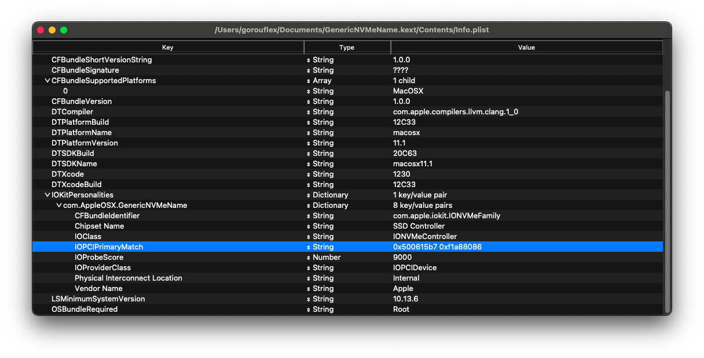
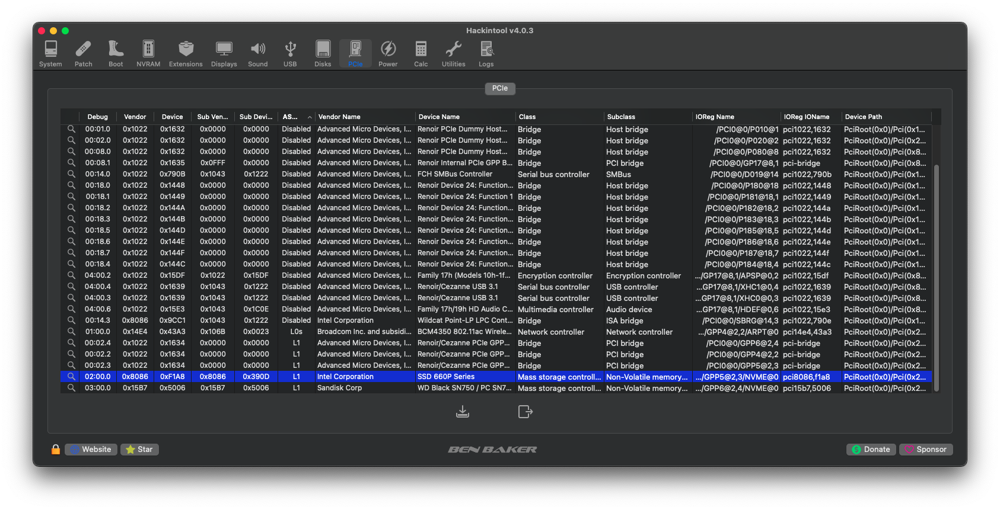

# GenericNVMeName
A codeless kext that patches the NVMe controller to rename it to Apple’s native one or something else

## Feature
- Rename `Generic SSD Controller` in System Information to `Apple SSD Controller` or something else

## Supported OS
- macOS High Sierra (10.13) to macOS Sonoma (14)
## Usage
1. Download from releases.
2. Click on `GenericNVMeName` kext and choose `Show Package Contents`.

3. Click on the `Contents` folder.

4. Edit `Info.plist`.

5. Find `IOPCIPrimaryMatch` under `IOKitPersonalities\com.AppleOSX.GenericNVMeName`.

6. To find your `IOPCIPrimaryMatch`, you should use Hackintool to find the NVMe `Vendor` and `Device` ID.

> [!NOTE]
> - For example, if your `Vendor` ID is `0xAAAA` and `Device` ID is `0xBBBB`, then you should combine both like this: `0xbbbbaaaa` (all in lowercase) and fill it into `IOPCIPrimaryMatch`.
> - It also supports multiple NVMe by separating with a space like `0xbbbbaaaa 0xddddcccc`
> - In my case, my `Vendor` ID is `0x8086` and `Device` ID is `0xF1A8`, so my `IOPCIPrimaryMatch` is `0xf1a88086`.
### [Optional]
- You can change the NVMe controller name by changing the `Vendor Name` and `Chipset Name` in `Info.plist`.

